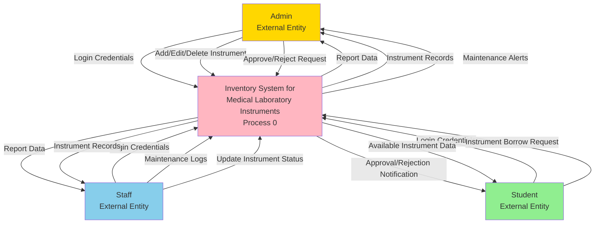

```mermaid
graph TD
    Admin[Admin<br/>External Entity]
    Staff[Staff<br/>External Entity]
    Student[Student<br/>External Entity]
    System[Inventory System for<br/>Medical Laboratory Instruments<br/>Process 0]
    
    Admin -->|Login Credentials| System
    Staff -->|Login Credentials| System
    Student -->|Login Credentials| System
    
    Admin -->|Add/Edit/Delete Instrument| System
    Staff -->|Maintenance Logs| System
    Staff -->|Update Instrument Status| System
    Student -->|Instrument Borrow Request| System
    Admin -->|Approve/Reject Request| System
    
    System -->|Report Data| Admin
    System -->|Instrument Records| Admin
    System -->|Maintenance Alerts| Admin
    System -->|Report Data| Staff
    System -->|Instrument Records| Staff
    System -->|Approval/Rejection Notification| Student
    System -->|Available Instrument Data| Student
    
    style Admin fill:#ffd700
    style Staff fill:#87ceeb
    style Student fill:#90ee90
    style System fill:#ffb6c1
```
